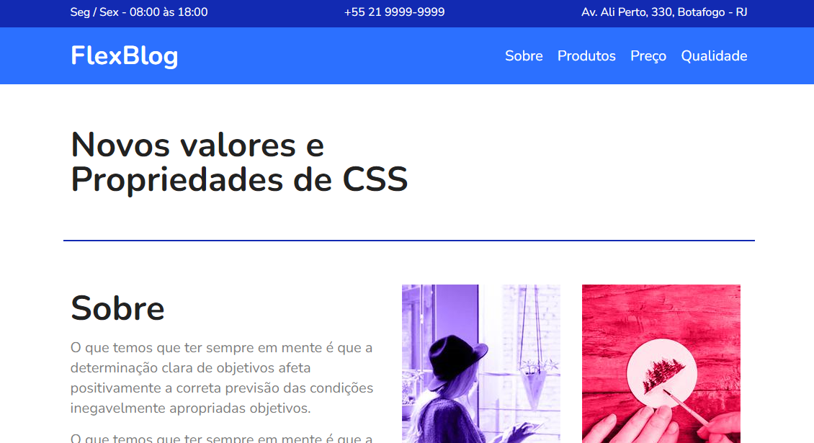

# FlexBlog

Project developed in the CSS FLEXBOX course - [Origamid](https://www.origamid.com/curso/css-flexbox) - [Certificate](https://drive.google.com/file/d/12OmGDoJEFGxdzmWXizsLgPpIXm8LRL4S/view).

The project uses CSS Flexbox.

[Project webpage](https://github.com/kelwynOliveira/FlexBlog/)

